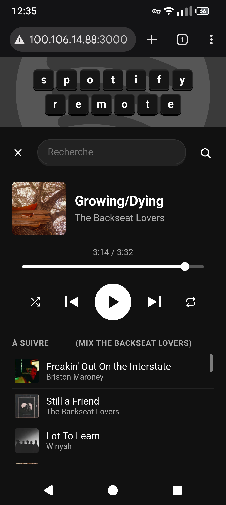
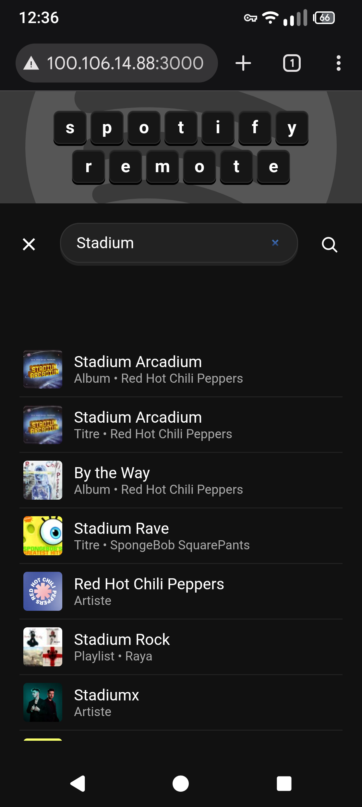
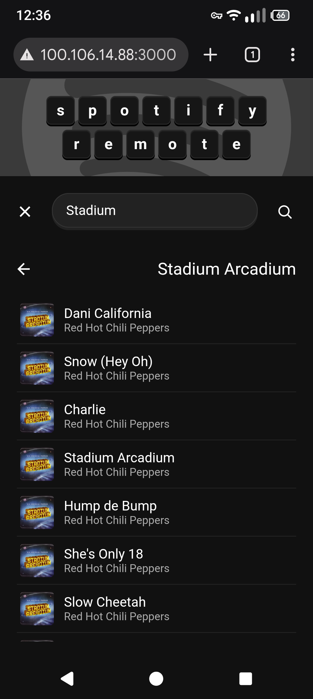
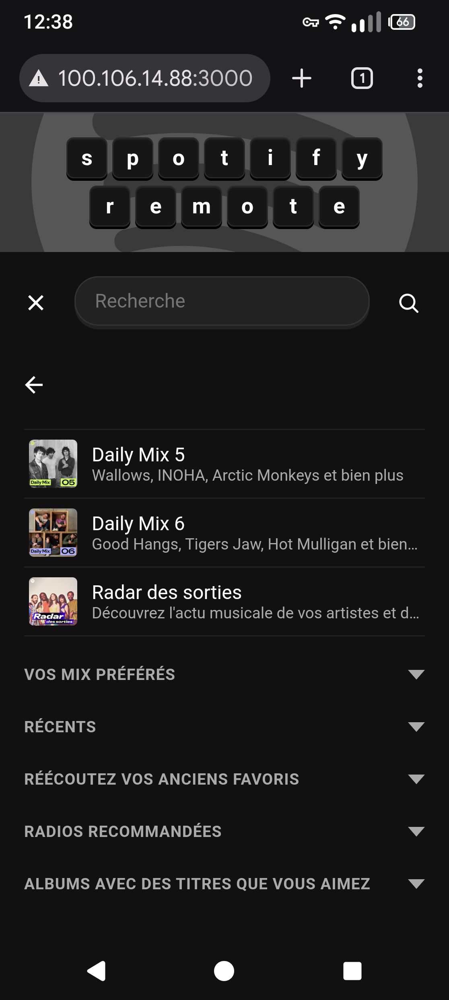

# Spotify Remote

A phone-facing web remote for controlling Spotify running in a desktop browser: play/pause, skip, search, browse your library, artists, albums and playlists, all from a page you open on your phone. It comes with a recommended companion setup for a dedicated, resource-conscious desktop session — including streaming that session's audio back to your phone too.

## Disclaimer

This is a personal project, **not affiliated with or endorsed by Spotify**. It works by remote-controlling an already-logged-in Chromium tab running Spotify's own Web Player (via the Chrome DevTools Protocol). It does not use any private or official Spotify API, and it very likely falls outside Spotify's Terms of Service for automated access to their client.

Use at your own risk. There is no warranty (see [LICENSE](./LICENSE)), and Spotify could change their web player's markup at any time and break parts of this without notice.

## Screenshots

<p>




</p>

## How it works

- `server.js` connects to a running Chromium instance over CDP (`chromium.connectOverCDP`) and drives the already-open Spotify Web Player tab with Playwright: reading the DOM to scrape your library/playlists/artists/albums, and clicking through the UI to navigate and search.
- Transport commands (play/pause/next/previous) go straight to Chromium's MPRIS interface over D-Bus instead of clicking DOM buttons, for reliability.
- A small static frontend (`public/`) is served by the same Express app, meant to be opened from your phone.
- Getting that audio onto your phone is handled by [AudioRelay](https://audiorelay.net) (available on Flathub) — a separate app, on both the desktop and your phone, not something the remote's own page does. `openbox-autostart.example` documents the desktop side.
- Pausing Spotify from the remote alone still leaves AudioRelay's connection open and transmitting (measured: it drops from about 240KB to about 70KB over 10 seconds while paused — real, but far from zero), so it doesn't save nearly as much battery/data as actually closing the connection would (which AudioRelay's own free-tier stop/start button, or premium's notification play/pause, does). `audiorelay-mpris-bridge.sh` keeps Spotify in sync with that instead.

**No built-in authentication**: there's no password or login, so don't expose this to the public internet (e.g. don't port-forward it). Use a private network like Tailscale to reach it remotely instead.

**Tuned for Chrome**: the phone-facing frontend was built and tested against Chrome for Android specifically — a handful of fixes (hiding scrollbars, blocking long-press text selection, working around Chrome's collapsing URL bar) rely on Chrome/WebKit-specific CSS and APIs. It should still load and work in other mobile browsers, just without these refinements.

**Language dependency**: some of the scraping logic matches specific French UI labels Spotify renders (e.g. "Discographie", "À suivre", "Titres likés"), because the author's own Spotify account is set to French. If your Spotify Web Player is in a different language, some features will silently fail to find what they're looking for. Adapting the string matches in `server.js` to another language should be straightforward if you want to try.

The frontend has its own separate language dependency: the search shortcuts ("p", "ar", "al" for Playlists/Artistes/Albums, see `librarySearchShortcuts` in `player.js`) are French abbreviations, unrelated to Spotify's own language. They won't make sense as-is in another language and would need picking new ones.

These two are independent - changing one doesn't require changing the other - but if you're adapting this to another language, it's worth updating both to match for consistency.

## Scope & design choices

This remote doesn't try to reproduce the full Spotify Web Player experience — navigation is intentionally simplified, especially around search, which is how the author mostly uses Spotify day to day. Some flows are reduced to whatever felt most relevant on a phone screen rather than mirroring every option the desktop/web client offers, so a few things you're used to in the real Spotify client may behave differently here, or not exist at all.

## Requirements

- Linux with D-Bus available (`gdbus` on your `PATH`) — used for MPRIS transport commands.
- [Node.js](https://nodejs.org/) 18+.
- Chromium or Google Chrome, launched with remote debugging enabled and already logged into [open.spotify.com](https://open.spotify.com):

  ```
  chromium --remote-debugging-port=9222 --app=https://open.spotify.com --start-maximized
  ```

  Keep the window maximized (`--start-maximized` above does this on launch) — the scraping logic scrolls through however many items fit on screen, so a small window means more scrolling and slower scraping.

  Don't forget to install an ad blocker like [uBlock Origin](https://ublockorigin.com/) in this Chromium.

## Setup

```bash
git clone <this repo>
cd spotify-remote
npm install
```

`openbox-autostart.example` documents a full recommended session setup (virtual audio sink, launching Chromium, launching AudioRelay, and launching the server itself) as a copyable template for a dedicated session running just this project — copy it to `~/.config/openbox/autostart`. Install [AudioRelay](https://audiorelay.net) on your phone too, to actually hear what you're controlling: open Tailscale to find the machine's Tailscale IP, then enter it in AudioRelay on your phone to connect. Set AudioRelay's buffer amount to high in its settings — a low buffer leads to noticeably choppier playback over a remote (non-LAN) connection like Tailscale.

Optionally, [EasyEffects](https://github.com/wwmm/easyeffects) can sit between Chromium and the virtual sink to level out loudness differences between tracks. `openbox-autostart.example` has the details (install command, and the Auto Gain settings this project settled on).

`audiorelay-mpris-bridge.sh` (already wired into `openbox-autostart.example`) mirrors AudioRelay's own connect/disconnect events onto Spotify's play/pause, so that stopping/starting AudioRelay's transmission (via its stop/start button) pauses/resumes Spotify to match, instead of the two drifting out of sync. See the script itself for the reasoning.

If you set this dedicated session up, make sure your display manager doesn't boot straight into it. It's also not something you want live right after a cold boot, especially since a minimal session like this is more likely to fail to start cleanly than your main one. On GDM with autologin enabled, this is a real pitfall: it silently re-logs into whichever session was last selected at the greeter (tracked per-user by AccountsService), so picking the dedicated session there even once makes it the autologin target from then on. Pin your main session instead by writing it directly to `/var/lib/AccountsService/users/<username>` (e.g. `Session=gnome`, `SessionType=wayland`) so autologin always lands there regardless of what was last picked manually.

If you'd rather skip the dedicated-session setup entirely, three manual steps are all you actually need: launch Chromium with the command from the [Requirements](#requirements) section above, log into Spotify in it, then start the server:

```bash
node server.js
```

(The autostart script above does both of these automatically on login)

Open `http://<machine-ip>:3000` from your phone (over Tailscale or whatever private network reaches that machine).

## License

MIT — see [LICENSE](./LICENSE).
